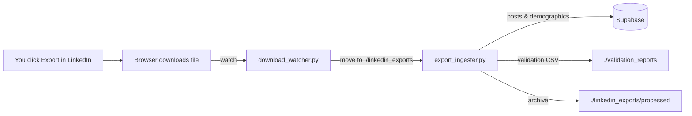

# Wentors LinkedIn Company Analytics Pipeline

Automated, ToS‑compliant pipeline to ingest LinkedIn Company Page analytics (posts and follower demographics) into Supabase — no scraping, no API, and no manual file moves.

You click Export in LinkedIn. Your browser downloads the file. The watcher detects it, moves it, and the ingester writes clean, deduped data to Supabase, with history snapshots for trending.

Features
- Continuous mode: instant ingestion on every new download (download_watcher.py)
- Robust file support: .xls (true Excel 97–2003), .xlsx, .csv, .zip (auto-extract)
- Clean post typing: text, article, image, document, video (never “organic/sponsored”)
- Metrics normalization: CTR, engagement_rate recalculated from raw metrics
- Hashtags and mentions extraction
- Deduplication:
  - Posts: unique by post_id (URN/URL-based)
  - Demographics: unique by (company_id, type, value, day)
- Smart updates: merge policy keeps higher metrics on re-ingest to avoid regressions
- Daily snapshot: per-post metrics history (optional but recommended)
- Validation reports and automatic file archiving

How it works (flow)


What this pipeline does not do
- No scraping or automated login to LinkedIn
- No API calls (you can add them later once you get MDP access)
- It’s fully ToS-compliant: uses official exports you initiate

Repository layout
- download_watcher.py — Continuous mode: watches Downloads, moves LinkedIn exports, triggers ingestion
- export_ingester.py — Loads files, maps columns, normalizes, dedupes, upserts to Supabase
- supabase_io.py — Supabase I/O + merge policy + history snapshot
- normalizer_utils.py — Post type classifier, CTR, hashtags, mentions
- orchestrator.py — Optional polling mode (moves + ingests every N minutes; supports IMAP later)
- file_collector.py — Mover used by orchestrator (polling)
- email_export_fetcher.py, email_digest_parser.py, digest_ingester.py — Optional IMAP email ingestion (attachments/digests)
- requirements.txt — Dependencies (xlrd pinned for .xls)
- .env.example — Template env file (copy to .env)
- validation_reports/ — Auto-generated CSVs of what was ingested
- linkedin_exports/ — Ingestion folder (watch target) and processed/ archive

Requirements
- Python 3.10+
- Supabase project (URL + Service Role Key)
- Windows/macOS/Linux (watchdog supports all; examples below assume Windows)
- No LinkedIn API needed

Setup (one-time)
1) Clone and install
- Windows PowerShell:
  - python -m venv venv
  - venv\Scripts\activate
  - pip install -r requirements.txt

2) Copy env template
- Copy .env.example to .env and fill values (see Env Vars section)

3) Create runtime folders
- mkdir linkedin_exports validation_reports

4) Database migration (run in Supabase SQL editor)
- Dedup demographics per day + maintain updated_at on post updates:
```
create unique index if not exists follower_daily_unique_idx
on follower_analytics (company_id, demographic_type, demographic_value, date_collected);

create or replace function set_updated_at() returns trigger as $$
begin
  new.updated_at = now();
  return new;
end;
$$ language plpgsql;

drop trigger if exists trg_set_updated_at on post_analytics;
create trigger trg_set_updated_at
before update on post_analytics
for each row execute procedure set_updated_at();
```

- Optional (recommended): per‑post daily history
```
create table if not exists post_metrics_history (
  id bigserial primary key,
  company_id text not null,
  post_id text not null,
  observed_at timestamptz default now(),
  observed_date date not null default (current_date),
  post_date timestamptz,
  impressions integer default 0,
  clicks integer default 0,
  likes integer default 0,
  comments integer default 0,
  shares integer default 0,
  reach integer default 0,
  ctr numeric default 0,
  engagement_rate numeric default 0
);

create unique index if not exists post_metrics_hist_daily_uniq
on post_metrics_history (company_id, post_id, observed_date);
```

Env vars (.env)
- Required
  - SUPABASE_URL=https://YOUR_PROJECT.supabase.co
  - SUPABASE_SERVICE_ROLE_KEY=your_service_role_key
  - COMPANY_ID=wentors
  - COMPANY_NAME=Wentors
- Paths
  - LINKEDIN_DATA_PATH=./linkedin_exports
  - VALIDATION_REPORTS_PATH=./validation_reports
- Date handling
  - LINKEDIN_DATE_DMY=true      # set true if your exports use DD/MM/YYYY
  - LINKEDIN_TZ_OFFSET_HOURS=0  # optional timezone shift for post_date (e.g., 1 for WAT)
- Watcher
  - DOWNLOAD_SOURCE_DIR=C:\Users\YOUR_USER\Downloads
- Update policy
  - POST_UPDATE_POLICY=max       # 'max' keeps higher of existing vs incoming; 'new' overwrites

Run (continuous mode, recommended)
- Start the watcher:
  - python download_watcher.py
- You’ll see:
  - Watching: C:\Users\YOUR_USER\Downloads
  - Target ingest dir: C:\path\to\linkedin_exports
- Click Export in LinkedIn (Content/Updates and/or Followers)
  - Browser downloads to Downloads
  - Watcher moves file into ./linkedin_exports and triggers ingestion
  - Console shows:
    - Moved filename -> 2025..._filename
    - Inserted/updated N posts from 2025..._filename
- Data lands in Supabase:
  - post_analytics (posts)
  - follower_analytics (demographics)
  - company_analytics (summary rollup)
  - analytics_history (snapshot per ingest)
  - post_metrics_history (daily snapshot per post, if enabled)

Optional: auto-start on Windows (Task Scheduler)
1) Create start_watcher.bat
- C:\Users\YOUR_USER\Wentors_playwright\start_watcher.bat
```
@echo off
cd /d C:\Users\YOUR_USER\Wentors_playwright
call venv\Scripts\activate.bat
python download_watcher.py >> logs\watcher.log 2>&1
```
- mkdir logs

2) Task Scheduler
- Create Task → General: Name “Wentors LinkedIn Watcher”, Run with highest privileges
- Triggers: At log on
- Actions: Start a program → Program: cmd.exe → Arguments:
/c C:\Users\YOUR_USER\Wentors_playwright\start_watcher.bat
- Start in: C:\Users\YOUR_USER\Wentors_playwright
- Settings: Enable “If the task fails, restart every 1 minute up to 3 times”; uncheck auto-stop limits

Data mapping and behavior
- post_analytics (primary table)
  - Unique key: post_id (md5 of URN/URL or content+date)
  - post_type: one of [text, article, image, document, video] (distribution like “Organic” is ignored)
  - CTR, engagement_rate recalculated from clicks/impressions and (likes+comments+shares+clicks)/impressions
  - Hashtags/mentions extracted from text
  - Dedup: upsert by post_id; updated_at set via trigger
  - Merge policy on re-ingest:
    - Default POST_UPDATE_POLICY=max → keeps higher of each numeric metric (avoid regressions in later exports)
    - Recomputes CTR and engagement_rate accordingly
- follower_analytics (demographics)
  - Unique per (company_id, demographic_type, demographic_value, date_collected)
  - date_collected set to midnight UTC for the current day to prevent same-day duplicates
- company_analytics and analytics_history
  - Updated on each posts ingest; analytics_history stores snapshots
- post_metrics_history (optional)
  - Daily snapshot of per-post metrics for trending (observed_date unique per post)

Validations (quick SQL checks)
- Latest posts:
```
select post_id, post_date, post_type, impressions, clicks, likes, comments, shares, ctr, engagement_rate
from post_analytics
where company_id = 'wentors'
order by created_at desc
limit 20;
```

- Dedup check (posts):
```
select post_id, count(*)
from post_analytics
where company_id='wentors'
group by post_id
having count(*) > 1;
```

- Distinct post types:
```
select distinct lower(post_type) from post_analytics where company_id='wentors';
```

- Latest demographics:
```
select demographic_type, demographic_value, count, percentage, date_collected
from follower_analytics
where company_id='wentors'
order by date_collected desc, demographic_type
limit 50;
```

Troubleshooting
- Watcher runs but doesn’t move file
  - Ensure DOWNLOAD_SOURCE_DIR is correct
  - Ensure the filename ends with .xls/.xlsx/.csv/.zip and contains “content/updates/posts/analytics/followers”
  - Large files: watcher waits until file size is stable; give it a few seconds
- “No data in posts file”
  - Open the export and re-save as .xlsx or .csv; try again
  - Ensure xlrd==1.2.0 installed for .xls: pip show xlrd → 1.2.0
- Supabase error: missing credentials
  - Ensure .env present and python-dotenv loaded (we autoload in supabase_io.py)
- Dates off by day/month
  - Set LINKEDIN_DATE_DMY=true if your exports use DD/MM/YYYY
  - Optional: set LINKEDIN_TZ_OFFSET_HOURS to your reporting timezone (e.g., 1 for WAT)
- Duplicate demographics
  - Ensure you ran the unique index migration
  - We normalize date_collected to midnight UTC; re-ingests update, not duplicate

Security and secrets
- Never commit .env or any keys (service role key is powerful)
- .gitignore already excludes .env and local data folders
- Limit who can run the watcher (it contains your Supabase service key)

Roadmap (optional)
- API-first mode once your LinkedIn MDP app is approved (full automatic per-post stats without exports)
- Staleness alerts (email/Slack) if no new exports ingested in N days
- Dashboard views (v_post_analytics_reporting) for BI tools
- IMAP mode for weekly digest parsing to keep high-level company metrics fresh between exports

License
- MIT (or add your preferred license)

Contributing
- PRs and issues welcome. Please don’t include real keys or data in examples.